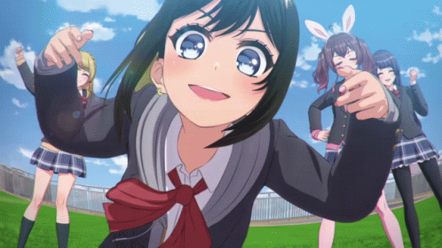

    
    <h1>Hi, my name is Timur 👋</h1>
    
I'm a Full-stack developer with experience in building modern web applications.

---

### 🛠️ Technologies and Tools

#### **Programming Languages**

#### **Frontend**

#### **Backend**

#### **Other Tools**

---

### 📊 GitHub Stats

    
    

---

### 📫 How to Reach Me

- **Email**: nisprogrammer@gmail.com
- **Telegram**: https://t.me/nistontimur

---

### 💼 Projects

Here are some of my projects:

- **[Car rental](https://github.com/NistonT/car-rental)**
- **[Anime application](https://github.com/NistonT/anime-application)**
- **[News wall](https://github.com/NistonT/news-wall)**

---

End
